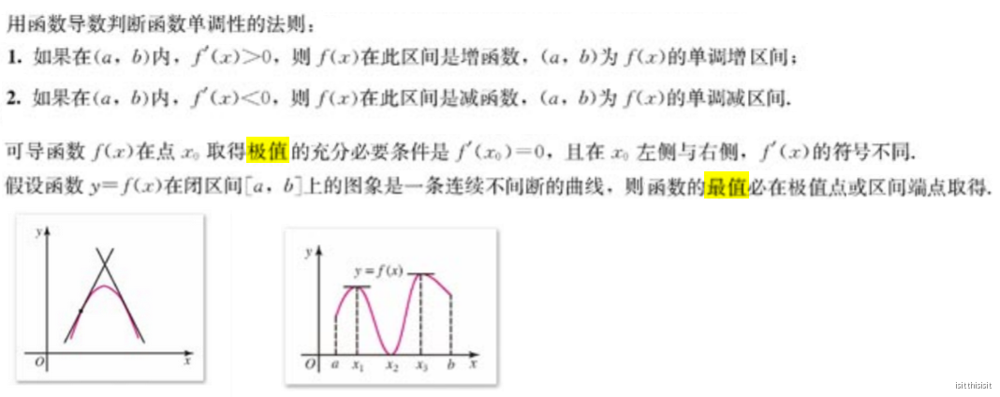
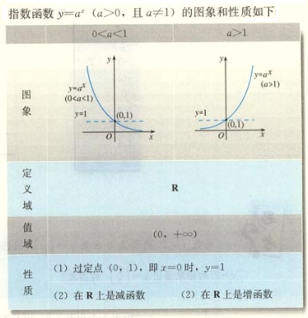

# 数学基础知识

### 1.符号、定义

#### 1.1根式

#### 1.2对数

#### 1.3向量

#### 1.4导数

#### 1.5定积分

#### 1.6微积分

#### 1.7偏导数

偏导数的几何意义：

#### 1.8 矩阵

**矩阵的迹：**在线性代数中，一个n×n矩阵A的主对角线（从左上方至右下方的对角线）上各个元素的总和被称为矩阵

A的迹（或迹数），一般记作tr(A)。

---

**矩阵与向量**

****

****

---

**二阶矩阵变换**

****

#### 1.9 标准差

量化数据离散程度的方法：

* 极差 = 最大值 — 最小值。但只有两个数据来评判一组数据，是不科学的。
* **离均差** (deviation from mean)= 数据 — 均值。因为离散度是数据偏离均值的程度，可以将离均差累加，来衡量离散程度；但离均差有正有负，所以一般用离均差的绝对值之和，或**离均差的平方和**，衡量离散程度。
* **方差**：离均差平方和的平均值。离均差的平方和的大小和样本数量有关，为了增加可比性，对离均差的平方和求平均值。
* **标准差**：方差的算术平方根。方差是数据的平方，与检测值本身相差较大，所以用方差开根号来衡量离散度。

 

### 2.公式、定理、性质

#### 2.1对数

#### 2.2导数、积分

【问题引出】求函数曲线的切线？求曲线形的面积？

【基本思想】求导和求积分是互为逆运算，运算的对象是函数/曲线，求导和求积分的基本思想是以直代曲、用高倍放大镜观察一条曲线的微小片段。

 

#### 2.2.1矩阵的导数

#### 2.3高阶偏导数

#### 2.4矩阵

### 3.函数

#### 3.1指数函数

#### 3.2对数函数

#### 3.3幂函数

