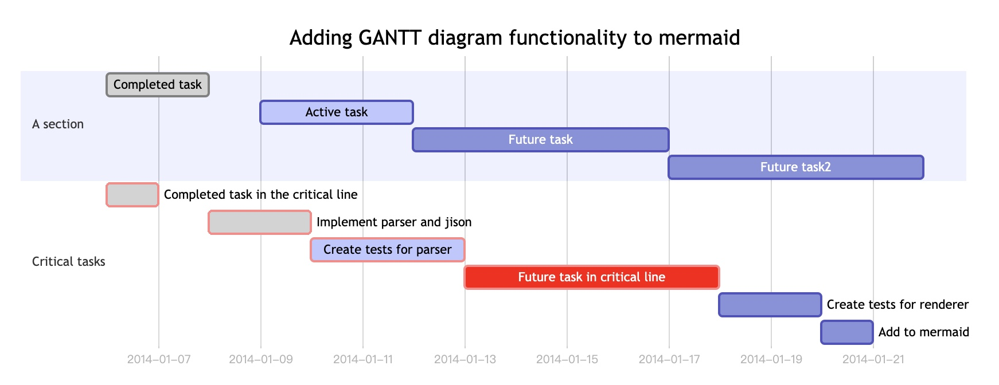

# Mermaid 基本语法

官方教程：https://mermaidjs.github.io


### graph TD
```
graph TD
 B["fa:fa-twitter for peace"]
 B--\>C[fa:fa-ban forbidden]
 B--\>D(fa:fa-spinner)
 B--\>E(A fa:fa-camera-retro perhaps?)
```


### graph LR
```
graph LR
    A[Hard edge] -->|Link text| B(Round edge)
    B --> C{Decision}
    C -->|One| D[Result one]
    C -->|Two| E[Result two]
```


流程图的方向
* TB – top bottom
* BT – bottom top
* RL – right left
* LR – left right
* TD – same as TB

```
graph LR
id1[方型边框]-->箭头连接
id1---直线连接
id1-.->虚线
id1==>重线
id2-- 文本连接 type1---文本连接
id2-->|文本连接 type2|文本
id2-->mm["This is the (符号转置) in the box"]
id2(圆角)
id3((圆))
id4>不对称]
id4{菱形}
```


### graph TB
```
graph TB
    subgraph one
    a1-->a2
    end
    subgraph two
    b1-->b2
    end
    subgraph three
    c1-->c2
    end

    c1-->a2
```


### 甘特图
```
gantt
        dateFormat  YYYY-MM-DD
        title Adding GANTT diagram functionality to mermaid
        section A section
        Completed task            :done,    des1, 2014-01-06,2014-01-08
        Active task               :active,  des2, 2014-01-09, 3d
        Future task               :         des3, after des2, 5d
        Future task2               :         des4, after des3, 5d
        section Critical tasks
        Completed task in the critical line :crit, done, 2014-01-06,24h
        Implement parser and jison          :crit, done, after des1, 2d
        Create tests for parser             :crit, active, 3d
        Future task in critical line        :crit, 5d
        Create tests for renderer           :2d
        Add to mermaid                      :1d
```

