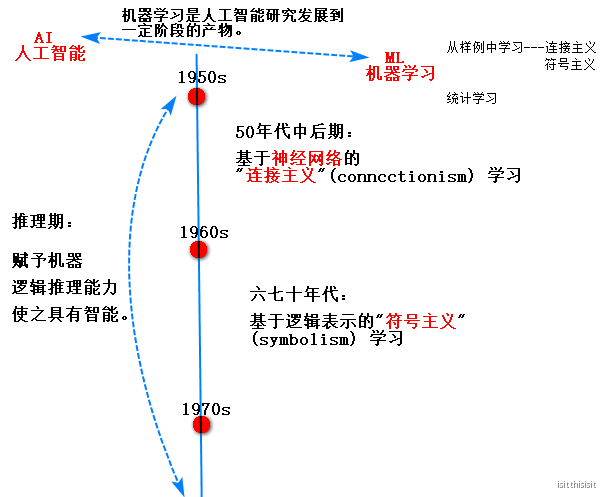

# 机器学习

## 1.什么是机器学习？

机器学习的诞生来源于两个领域：

人工智能（artificial intelligence）。

 ML是AI四象限中的一个（think optimal）。

 人工智能主要包括机器学习和深度学习。深度学习是机器学习的一个分支。

数据科学（data science）。

---

机器学习(Machine Learning):根据已有的经验(**数据**)，找(**算法**)出规律(**模型**)，并用于**预测**未知的数据，重视模型的**泛化**generalization能力。

即对于一个任务T,根据经验E,有一个表现的衡量P,随着E的增加，P在T上表现更好。

数据（指做了**数据预处理**和**特征工程**的数据）决定了模型的上限，而算法只是逼近这个上限。

---

机器学习可以理解为计算应用统计学；ML是关于**归纳induction**（特殊/具体到一般/抽象），而不是演绎deduction（一般/抽象到特殊/具体）或者 溯因abduction。

---

### 1.1机器学习的历史

### 1.2 归纳、演绎、溯因

归纳、演绎、溯因是推理的三种常见形式，而机器学习中任务是关于归纳的。

## 2\. 机器学习中的任务分类

（1）**监督（supervise）学习任务**：

* 定义：给定的数据中有明确的预测数据。获取打标签的数据集，获取信息，从而标记没有标签的数据。监督学习是关于函数逼近approximation。
* 回归（**拟合**）：预测的数据是连续值的任务。损失函数是MSE。

 算法：knn,线性回归，Lasso,Ridge,生存回归，保序回归，随机森林， 

 GBDT,xgboost,神经网络等

* 分类（**找分界**）：预测的数据是离散值的任务。大部分损失函数是交叉熵(cross-entropy).

 算法：knn,逻辑回归，softmax,svm,朴素贝叶斯，决策树，随机森林，

 GBDT,xgboost,神经网络等

（2）**非监督（unsupervise）学习任务**：

* 定义：给定的数据中没有明确的预测数据。通过查看输入本身之间的关系推导出某些结构。非监督学习是关于描述description。如果非监督学习对类别有正确的描述，它可以有助于监督学习更好的进行函数逼近。

* 聚类：将原始的数据分为多个组。

 算法：kmeans,kmeans++,canopy,dbscan,谱聚类，GMM等

* 降维：把原始数据的特征数减少。

 算法：PCA,LDA,SVD

（3）**半监督学习任务**：

* 定义：给定的数据中有部分有明确的预测数据，有部分没有。

（4）**增强（reinforce）学习**

* 定义：通过延迟奖赏（delayed reward）进行学习。举例：下五子棋，监督学习会告诉你走的每一步是好是坏，增强学习不会告诉你，直到最终判断是赢是输。

阿里巴巴算法专家华校专对机器学习的分类如下：

## 3.机器学习项目的流程

实际项目中有2/3的时间在处理数据。

特征工程：提取特征；在已有特征的基础上，增加特征，或减少特征。

要想使模型有更好的泛化能力，总体上，可以从数据和算法两个角度去改变：

## 4.机器学习中的专业术语

* 样本sample：样本就是一条记录，或者一条数据。
* 样本集 sample set:多个样本的集合。又叫数据集。
* 训练集training set：用于训练模型的数据集。通常是原始数据集的2/3~3/4
* 测试集 test set:用于评估模型的数据集。
* 输入数据：就是样本中除去预测的值那一列。用大写X表示
* 输出数据：样本中的预测值那一列。用小写y表示。
* 特征：数据的属性在机器学习中被称为特征。
* 特征向量：多个特征组合在一起被称为特征向量。
* 维度：指特征的数量。
* 二分类：预测的结果只有2个，这类问题被称为二分类问题。在二分类的问题中，关注的类别被称为正类(positive)，不关注的问题被称为负类(negative)
* 拟合：指找出模型去接近原始数据规律的过程
* 过拟合(over fiting):过分的学习数据的原始/一般特征，将数据的特有特征也学习到了。
* 欠拟合:数据的一般特征都没有学习好。
* 泛化：模型应用于新样本的能力。
* 预测值：新样本根据模型预测得到的值。用表示，y\_hat。
* 交叉验证：将原始数据分成n份，称为n折交叉验证；每次取出1份作为测试集，其他用来训练，最终生成n份模型，n次模型评估，取一个最佳的模型。除了交叉验证，还有留出法（数据集中70%训练，留出30%测试）。

## 5.过拟合overfitting

过拟合是通常是机器学习中算法表现不佳的主要原因。

奥卡姆剃刀定律（Occam's Razor）：如无必要，勿增实体；在其他条件一样的情况下，选择较不复杂的假设。

当假设越来越复杂（即模型更复杂）时，训练数据误差error小了，更拟合数据了，但会出现过拟合情况，泛化误差和过拟合误差大，泛化能力弱；

选择复杂度较低的模型，反而可以获得较好的泛化能力。