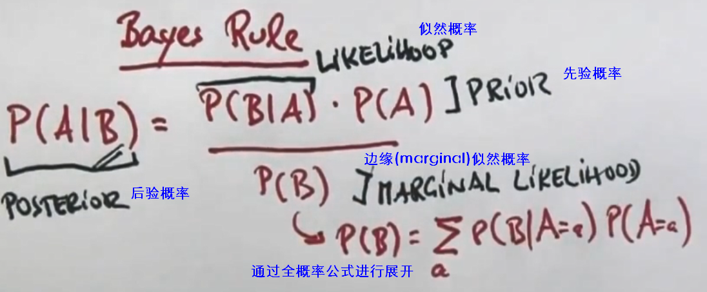
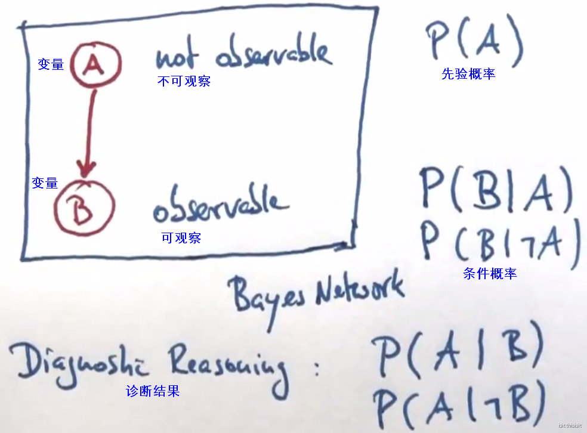

# 贝叶斯Bayes

贝叶斯：统计学statistics概念，英国数学家Reverend Thomas Bayes发明。

## 贝叶斯法则 Bayes rule

在已知事件B发生的条件下，A的概率。公式的似然概率中包含了概率的反向推导。

举例：

A： 患者得癌症的概率。

B：检测结果。

## 贝叶斯网络 Bayes networks

将贝叶斯法则画图表示，得到贝叶斯网络：

要定义贝叶斯网络需要3个参数：1一个用来指定P(A)，2个分别用来指定条件概率。