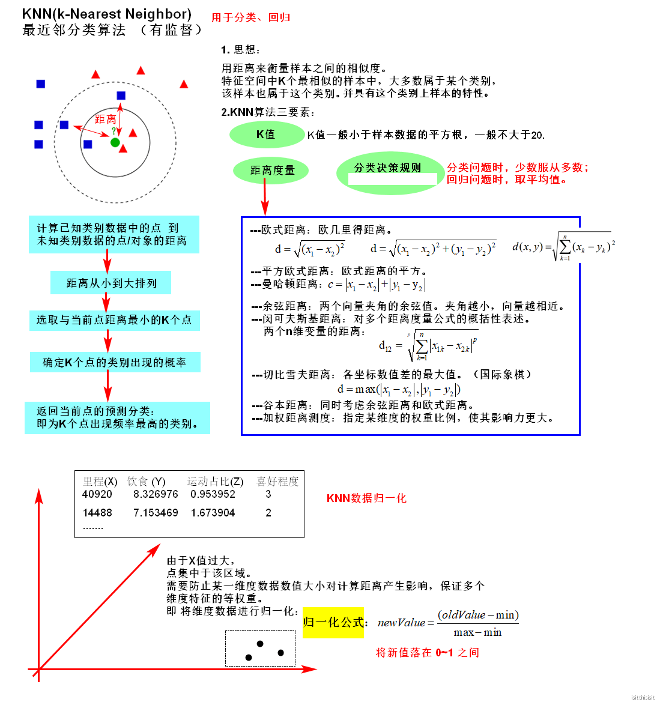

# KNN---回归/分类

### 1.图解KNN

 knn的变种算法：KD树、球树。（KD树， 球树之类的模型建立需要大量的内存）

### 

### 2.K值的选择

对于k值的选择， 没有一个固定的经验， 一般根据样本的分布， 选择一个较小的值， 可以通过交叉验证选择一个合适的k值。
选择较小的k值， 就相当于用较小的领域中的训练实例进行预测， 训练误差会减小， 容易发生过拟合。
选择较大的k值， 就相当于用较大领域中的训练实例进行预测， 其优点是可以减少泛化误差， 但缺点是训练误差会增大。