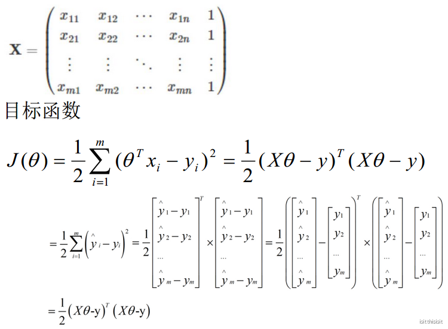

# 线性回归---回归

线性回归 linear regression属于线性模型的一种，广义线性模型主要包括：

## 1.回归问题

回归模型是表示输入变量到输出变量之间映射的函数， 回归问题的学习等价于函数拟合： 使用一条函数曲线

使其很好的拟合已知函数且很好的预测未知数据。

## 2.线性回归公式

将截距单独拎出来。

---

将截距算进向量相乘的结果中。x 表示m行（n+1）列的矩阵，m代表样本数量，n表示数据集中的维度，1表示增加的一列（数值都为1）。

## 3.最小化损失函数

一元线性回归中，对于每一个样本，ε 表示真实值和预测值之间的差异：

  

一元线性回归的损失函数loss function （MSE: mean square error）(最小二乘法公式)：

**MSE 只与正态分布和似然估计有关，换做回归以外其他机器学习算法，损失函数也可以是MSE。**

【目标】使ε差异在总体上尽可能的小，求出误差最小时的w、b值。

【问题】**为什么损失函数是计算平方和**？

#### 3.1 正态分布normally distributed

每个样本的实际值 = 预测值 + 误差。

假设所有样本都是独立同分布的，**假设数据服从****正态分布**，实际值在预测曲线上下震荡，根据中心极限定理，**误差值服从****正态分布**（也服从高斯分布）。误差的均值是0，所以不能用误差的简单求和来评估损失的大小。

同分布：

做特征工程前后，数据的分布情况是一致的，例如之前是正态分布，特征工程之后也是正态分布。深度学习中，每一层的数据的分布也是一致的。

#### 3.2 概率密度函数

正态分布的概率密度函数如下：

（在数学中， 连续型随机变量的概率密度函数是一个描述这个随机变量的输出值， 在某个确定的取值点附近的可能性的函数。 而随机变量的取值落在某个区域之内的概率则为概率密度函数在这个区域上的积分。）

由于误差ε符合正态分布，将其代入概率密度函数：

#### 3.3 似然函数

最大似然估计（找出一组参数，使模型产生出观测数据的概率最大）思想下的似然函数是关于统计模型参数的函数。

关于参数θ的似然函数L(θ|x)等于给定参数θ后变量X的概率： L(θ|x)=P(X=x|θ)。

由于误差之间是相互独立的，整体样本的误差输出取值的可能性如下（**即目标函数**）：

#### 3.4 自然对数

为了便于将上述公式展开化解，对两边分别取以e为底的自然对数：

（由于）

让似然函数代表的概率越大越好，就代表误差取值在正态分布中更加集中；所以就要使 J(w)越小越好，即需要求解 J(w) 最小时的 w值 和 b值。

 

#### 3.5.1 偏导与解析解(正规方程)

**一元线性回归：**

将w，b看为未知变量，x，y看为常数。多个变量情况下求J(w)极值，所以要对 w、b求偏导。

复合函数的求导：

**多元线性回归**：

theta值有多个，不可能逐个对theta求偏导，所以使用矩阵：m行 \* (n+1)列。

将误差函数转化为有确定解的代数方程组，从而可求解出这些未知参数，而不用迭代的方法，这就是**正规方程(normal equations)法**。得到的参数的解就是**解析解**。

#### 3.5.2 梯度下降

#### 为什么用梯度？

对于n维矩阵，以上的解析解的复杂度是O(n)的三次方，所以我们使用梯度下降（gradient descent）的方法来求解局部最优解；因为线性回归损失函数是一个凸函数，此时使用梯度下降求解得到的其实是全局最小值。

#### 凸函数的判定

#### 什么是梯度？

对点x0的导数反映了函数在点x0处的**瞬时变化速率**。推广到多维函数中，就有了梯度的概念，梯度是一个**向量组合**，向量是有方向的，反映了多维图形中变化速率最快的方向（下坡最快）。

在微积分里面，对多元函数的参数求∂偏导数，把求得的**各个参数的偏导数以向量的形式写出来**，就是梯度。

比如函数f(x,y), 分别对x,y求偏导数，求得的梯度向量就是(∂f/∂x, ∂f/∂y)T,简称grad f(x,y)或者▽f(x,y)。

对于在点(x0,y0)的具体梯度向量就是(∂f/∂x0, ∂f/∂y0)T.或者▽f(x0,y0)。

#### 什么是梯度下降？

我们把要最小化或最大化的函数称为 目标函数（objective function）或 准则（criterion）。当我们对其进行最小化时，我们也把它称为 代价函数（cost function）、损失函数（loss function）或 误差函数（error function）。

通常使用一个上标 ∗ 表示最小化或最大化函数的 x 值。如我们记 **x****∗ ****=****arg min ****f****(****x****)**。 

导数 f ′(x) 代表 f(x) 在点 x 处的斜率。换句话说，它表明如何缩放输入的小变化才能在输出获得相应的变化： f(x + ϵ) ≈ f(x) + ϵf ′(x)。 

导数对于最小化一个函数很有用，因为它告诉我们如何更改 x 来略微地改善 y。例如，我们知道对于足够小的 ϵ 来说， f(x - ϵsign(f ′(x))) 是比 f(x) 小的，我们可以将 x 往导数的反方向移动一小步来减小 f(x)。这种技术被称为 梯度下降（gradient descent）。

#### 驻点

f ′(x) = 0 的点称为 **临界点****（****critical point****）**或** ****驻点****（****stationary point****）**。

有些临界点既不是最小点也不是最大点，这些点被称为 **鞍点（saddle point）**。

使 f(x) 取得绝对的最小值（相对所有其他值）的点是 全局最小点（global minimum）。

函数可能只有一个全局最小点或存在多个全局最小点，还可能存在不是全局最优的局部极小点（local minimum） 。

#### 梯度的意义？

从几何意义上讲，就是函数变化增加最快的地方。

具体来说，对于函数f(x,y),在点(x0,y0)，沿着梯度向量的方向就是(∂f/∂x0, ∂f/∂y0)T的方向是f(x,y)增加最快的地方；或者说，更加容易找到函数的最大值。

反过来说，沿着梯度向量相反的方向，也就是 -(∂f/∂x0, ∂f/∂y0)T的方向，梯度减少最快，也就是更加容易找到函数的最小值。

#### 梯度思想的三要素

梯度法思想的三要素：**出发点、下降方向、下降步长**。

alpha表示**学习率（learning rate）**，表示梯度下降的步长。例如：

#### 求解梯度

## 4.批量梯度下降BGD

每一次的参数更新都用到了所有的训练数据， 所以BGD算法会非常耗时。

## 5.随机梯度下降SGD

Stochastic Gradient Descent

SDG求出的解是可用的解，即符合定义的误差阈值内的解，但这个解可能不够精准。

SGD伴随的一个问题是噪音较BGD要多， 使得SGD并不是每次迭代都向着整体最优化方向。

## 6.小批量梯度下降MBGD

Mini-Batch Gradient Descent

解决BGD和SGD的缺点， 使得算法的训练过程比较快， 而且也要保证最终参数训练的准确率。

不同问题设置的batch是不一样的。