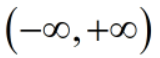
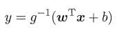
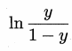
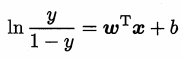
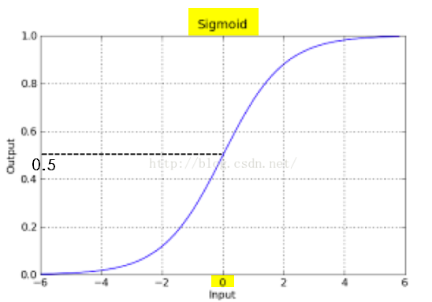
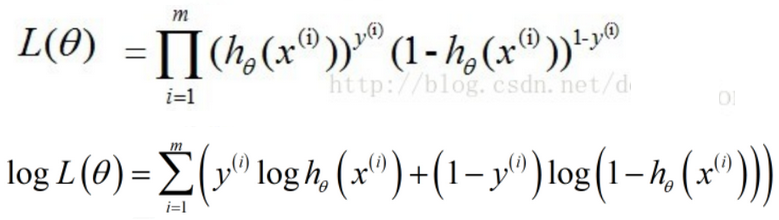
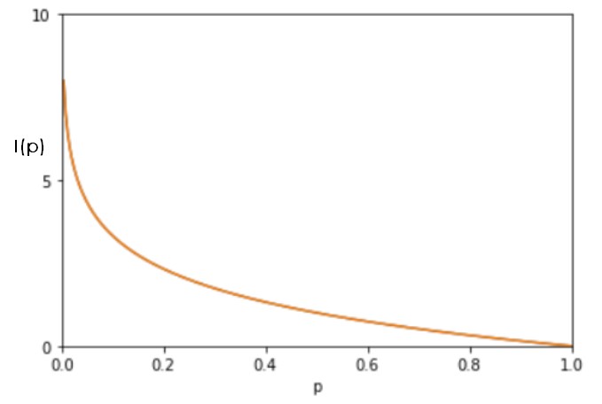
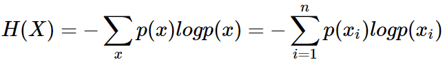
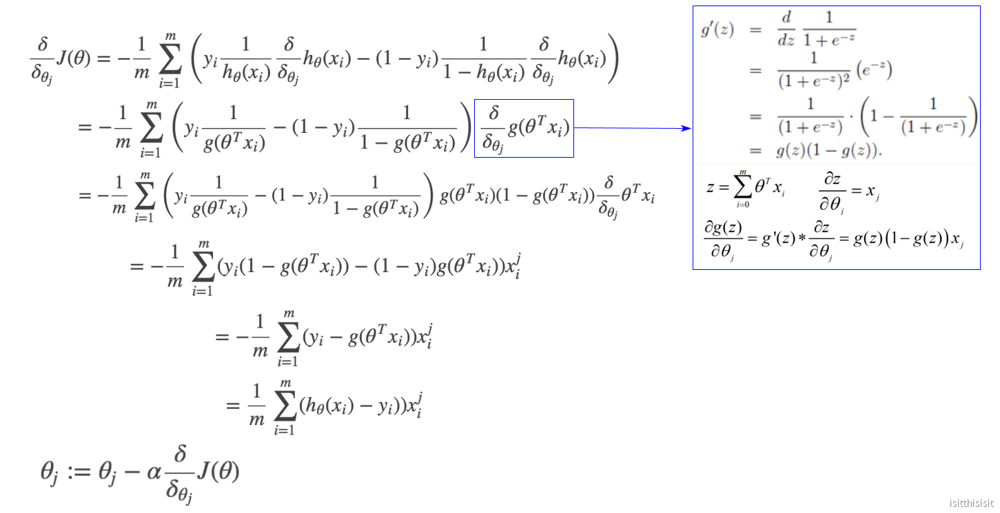
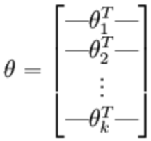

# 逻辑回归---分类

## 1.问题引出

分类问题中，线性模型会遇到对数据无法分类的问题，如何解决？如下：

线性模型的y取值范围为：，对于二分类问题（多分类问题也可以转为为二分类），可以从以下三个思路来思考解决线性模型无法分类的问题：

* 弃用线性模型，改为非线性模型；
* 将线性模型映射到高维空间，例如，用超平面来分类；
* 使线性模型的预测值逼近真实值的衍生物，例如，，如果可以将 z 值转为（0,1）范围内的预测值，就完成了分类任务。类似单位阶跃函数（unit-step function）: 

（单位阶跃函数不连续）

### 广义线性模型(generalized linear model)

称为联系函数（link function）。根据以上思路，假如能找到一个单调可微函数，**可以将线性回归模型的预测值和分类问题中的真实标记y联系起来**，就相当于用线性回归模型解决了二分类问题。

对数几率函数（logistic function）就是满足要求的一个单调可微函数。

### 对数几率函数

逻辑回归的意译为对数（logit）几率回归。根据以上思路，用线性回归模型的预测值去逼近真实标记的衍生物，即真实标记的**对数几率**（log odds 或 logit），几率表示样本为正例的可能性与反例的可能性的比值，几率取对数就得到对数几率：

### 逻辑变换

将对数几率函数代入广义线性模型，得到；

用预测值毕竟真实标记的对数几率，得到，即。

通过逻辑变换，将线性回归的预测值从，缩放到了(0,1)，代表对分类类别的**概率预测**。

逻辑回归也是**广义线性模型**的一种。

## 2.逻辑回归公式

，在坐标轴上表现如下：

### 2.1 损失函数

确定了一组w 或 theta 就确定了 z，确定了z 就确定了 g(z) 的输出, 那么g(z) 也可以写成 g(w,x)。

根据最大似然估计，，进而表示如下：

为了模型预测有最高的准确率，即找到一组theta值，使似然估计的L(theta)有最大值。为了将乘积展开，等式两边取对数，而且对数函数最大时（单调递增），L(theta)也最大。

损失函数：

以上损失函数又叫**交叉熵**损失函数（Cross Entropy Loss）。

### 2.2 交叉熵

熵 (entropy) 这一词最初来源于热力学。1948年，**克劳德·爱尔伍德·香农将热力学中的熵引入信息论**，所以也被称为香农熵 (Shannon entropy)，信息熵 (information entropy)。熵代表的是随机变量或整个系统的**不确定性**，熵越大，随机变量或系统的不确定性就越大。

一条信息的信息量大小和它的不确定性有直接的关系。可以认为，**信息量**的度量就等于不确定性的多少，不确定的多少可以用概率分布来表达，信息的量度应该依赖于**概率分布 p(x)**。

#### 信息量

如果有两个不相关的事件 x 和 y，那么两个事件同时发生时获得的信息量应该等于观察到事件各自发生时获得的信息之和：，两个事件是彼此独立的：
I(x) 也被称为随机变量 xx 的自信息 (self-information)，描述的是随机变量的某个事件发生所带来的信息量。

#### 熵

H(X) 被称为**随机变量 x 的熵**,表示随机变量不确定的度量，是对所有可能发生的事件产生的信息量的**期望**。从公式可得，随机变量的取值个数越多，状态数也就越多，信息熵就越大，混乱程度就越大。当随机分布为均匀分布时，熵最大，且 0≤H(X)≤logn。

#### 交叉熵

现在有关于样本集的两个概率分布 p(x) 和 q(x)，其中 p(x) 为真实分布， q(x) 非真实分布。

用真实分布 p(x)来衡量识别别一个样本所需要编码长度的期望（平均编码长度）为:

使用非真实分布 q(x)来表示来自真实分布 p(x) 的平均编码长度，则是：

此时就将H(p,q) 称之为交叉熵。交叉熵用来衡量在给定的真实分布下，使用非真实分布所指定的策略消除系统的不确定性所需要付出成本的大小。

交叉的字面意思在于：**真实分布与非真实分布的交叉**。给定一个方案, 越优的策略, 最终的交叉熵越低，具有最低的交叉熵的策略就是最优化策略。

交叉熵用于计算“学习模型的分布”和“训练数据的分布”之间的不同，当交叉熵最低（等于训练数据分布的熵）时，就相当于学到了最好的模型。

### 2.3 梯度下降

通过梯度下降，最小化损失函数：（以下的theta就是 w，代表参数）

## 3.多分类问题

多分类问题的解决思路：

* 将n分类转成n个2分类 ，训练出n个逻辑回归的模型 ；
* 用softmax处理多分类

### 3.1 softmax

**预测函数：**

为了预测类别，需要确定的是：

**损失函数：**

****

**梯度下降：**

****

**
**