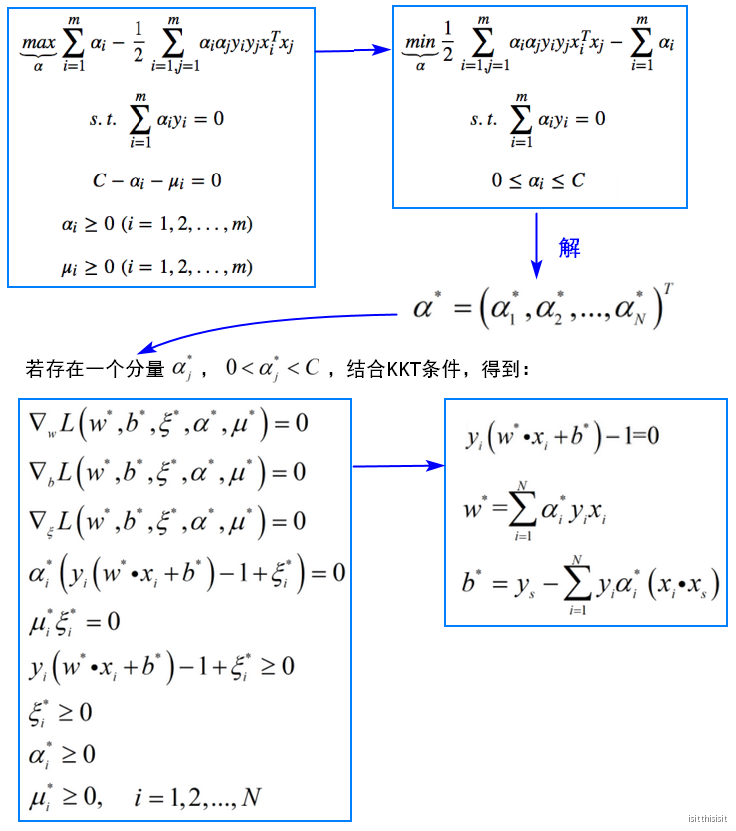

# SVM---分类

## 1.函数最优化问题

### 1.1 无约束条件的最优化问题

### 1.2 有约束条件的最优化问题

以下约束条件中没有考虑 \>0 的情况，因为可以由小于等于0反推出来。

将以上最优化问题命名为**原始（最优化）问题**。

**凸优化问题**：对于上述有约束条件的最优化问题，目标函数 f(x) 和约束函数 都是R上连续可微的凸函数，是R上的仿射函数（满足）

### 1.3 求解最优化问题

方法：梯度下降、L-BFGS、IIS等

### 1.4 拉格朗日函数

拉格朗日函数是将原始问题的f(x)和约束条件进行**整合**，

使有约束条件的最优化问题\>\>\>\>\>转为\>\>\>\>\>无约束条件的最优化问题。

使原始问题的一次优化问题\>\>\>\>\>转为\>\>\>\>\>极小极大的二次优化问题。

在约束最优化问题中，常利用**拉格朗日对偶性**（Lagrange duality）将原始问题转换为对偶问题，通过求解对偶问题得到原始问题的解。

拉格朗日乘子（Lagrange multiplier）:

拉格朗日乘子向量：

#### 拉格朗日函数的特性

#### 极小极大

由拉格朗日函数的特性可知，当x满足原始问题约束时， 就是原始问题的**f(x)**，此时进行极小化就等同于对原始（最优化）问题进行极小化，解是相同的，即：

#### 对偶问题

被称为拉格朗日函数的极大极小问题，也被称为原始问题的对偶问题。

定义 为对偶最优化问题的最优解，当** f(x)**和为凸函数，是仿射函数时，有：

，其中的约束条件为**KKT条件**：

## 2.Support Vector Machine

SVM：线性的分类（二分类）算法。

**基本思想**：求解能够正确划分训练数据集，且几何间隔最大的分离超平面。间隔最大化，意味着以充分大的确信度对训练数据进行分类。

支持向量机(Support Vector Machine)是Cortes和Vapnik于1995年首先提出的，它在解决**小样本、非线性及高维模式**识别中表现出许多特有的优势。

### 2.1 线性可分SVM

#### 线性可分性

给定一个数据集，如果存在某个超平面，满足：

* 将数据集的正实例点和负实例点完全正确的划分到超平面的两侧；
* 对所有的实例，都有；对所有的实例，都有。

则称以上数据集是线性可分（linearly separable）的。

#### 模型判别式：

，是线性的公式，本质是在**高维空间**找到一个**超平面**来分隔数据。

通常这样用于分隔的超平面有很多，哪一个最好？

#### 最好的超平面：

* 完美的分类正负例
* **距离**最近的点越远越好（对点位置变动的容忍度大），即**硬间隔**越大越好。（最大间隔法）
* （根据以上两点确定的超平面，求出y=0时的w值和b值。）

#### 几何距离和函数距离

函数距离（functional margin）可以表示分类的**正确性**和分类预测的**确信度**。

#### 最优化问题

* 根据距离公式，可以将最好的超平面的定义转换为函数的最优化问题：

* 如果将 w 和 b 等比例缩放为 λw 和 λb，函数间隔变成 λγ'，函数间隔的改变对不等式约束没有影响，对目标函数的优化也没有影响。于是，为了方便求解，直接令 γ' = 1，改变上述最优化问题，得到：

* 进一步根据上述最优化问题，构建拉格朗日函数：

* 根据对偶函数，先求极小值，拉格朗日函数分别对 w 和 b 求导，求出 w 和 b 各自与 α 的关系。

根据以上推导，求导得出：

* 将求导结果代入原来的函数：

* 进一步转换对偶问题的优化问题为：

* 通常使用SMO算法（序列最小最优化算法）进行求解，可以求得一组 α\*使得函数最优化。求解之后，α\*成为已知数，根据KKT条件，再求出 w\*，b\* .

#### 支持向量

由上述根据 α\* 推导 w\*，b\* 的过程可知，时，，此时对应的样本点 的实例就是支持向量，支持向量一定是在间隔边界上。

### 2.2线性SVM

#### 线性不可分

为了得到最好的分隔超平面，满足的条件有：

* （满足约束条件时）可以把正负例完美分开
* 找到间隔最大的点（函数优化问题）

对于线性不可分问题，会有噪声点，不满足线性可分SVM中的约束条件，为了放松约束条件，而引入松弛变量。

ξ代表异常点嵌入间隔面的深度,我们要在能选出符合约束条件的最好的w和b的同时,让嵌入间隔面的总深度越小越好。

#### 最优化问题

* 线性SVM的原始问题（凸二次规划问题）如下：

* 分类决策函数

求出原始问题的最优解，代入，即得到分类决策函数。

分离超平面为

* 构建拉格朗日函数

* 求解

* 用SMO算法求出 α\*.

#### 支持向量

SVM模型判别式的另一种表示：

**结论：每一次计算判别函数的结果时，需要求得判别点和所有训练集样本点的内积。**

**
**

### 2.3非线性SVM

#### SVM升维

为了处理线性不可分问题，可以引入升维，即把原始的 x 映射到更高维度的空间：

【问题】升维之后，再做向量的内积，会出现**维度爆炸**。

【解决】引入核函数。思路：不具体计算向量的内积，而是直接定义的结果。

#### 核函数

### 2.4 SVM算法流程总结

* 选择核函数及对应的超参数；
* 选择惩罚系数C；
* 构造最优化问题；
* 利用SMO算法求出一组 α\* ；
* 根据 α\*计算w\*
* 根据α\*找到全部的支持向量，计算每个支持向量对应的
* 对求均值，得到 b\*
* 得到判别函数和超平面。

【参考】

《统计学习方法》第二版 李航著；

<https://blog.csdn.net/u014540876/article/details/80172623>