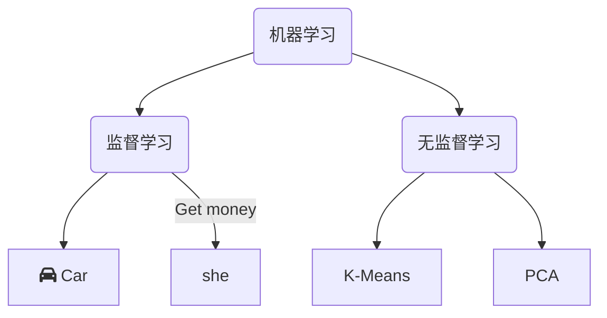

type1

```mermaid
graph TD;
  A-->B;
  A-->C;
  B-->D;
  C-->D;
```

type2
graph TD
0(机器学习) --> i(监督学习)
0 --> i2(无监督学习)
i --> he[fa:fa-car Car]
i --> |Get money| she
i2 --> K-Means
i2 --> PCA

type3

```mermaid
graph TD
0(机器学习) --> i(监督学习)
0 --> i2(无监督学习)
i --> he[fa:fa-car Car]
i --> |Get money| she
i2 --> K-Means
i2 --> PCA
```