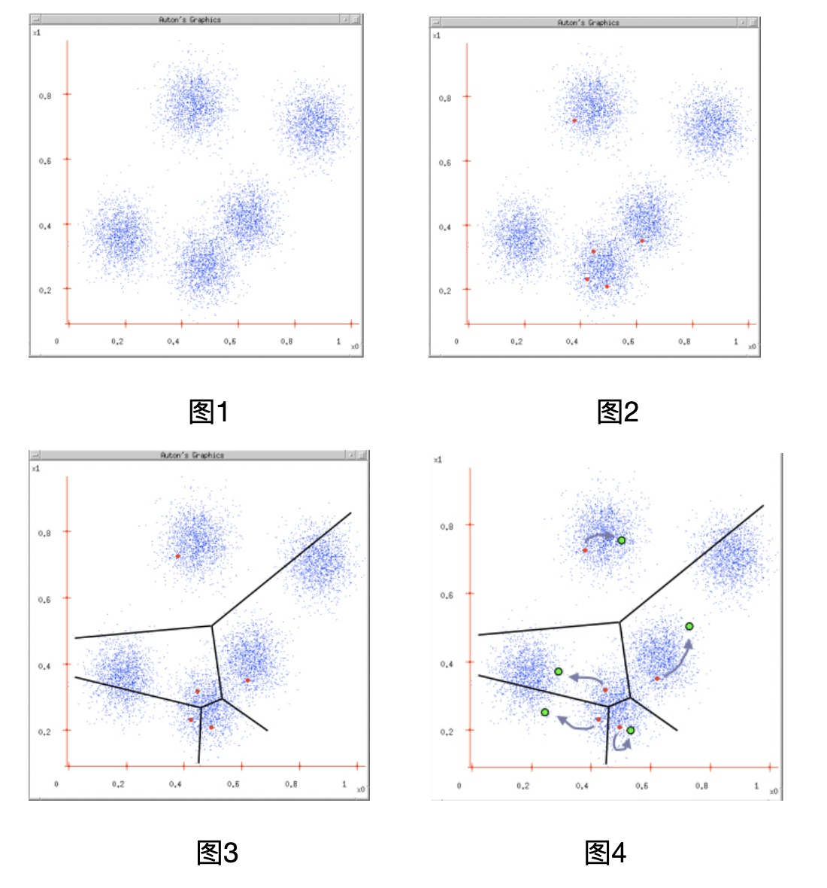
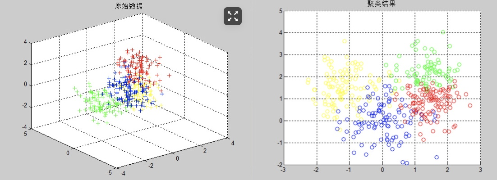

# K-means：理论

<a name="LQYni"></a>
## 一、K-均值聚类（K-means）概述

<a name="fICZE"></a>
#### 1. 聚类
“类”指的是具有相似性的集合。聚类是指将数据集划分为若干类，使得类内之间的数据最为相似，各类之间的数据相似度差别尽可能大。聚类分析就是以相似性为基础，对数据集进行聚类划分，属于无监督学习。

<a name="QoqDp"></a>
#### 2. 无监督学习和监督学习
和KNN所不同，K-均值聚类属于无监督学习。那么监督学习和无监督学习的区别在哪儿呢？监督学习知道从对象（数据）中学习什么，而无监督学习无需知道所要搜寻的目标，它是根据算法得到数据的共同特征。比如用分类和聚类来说，分类事先就知道所要得到的类别，而聚类则不一样，只是以相似度为基础，将对象分得不同的簇。

<a name="fPkkM"></a>
#### 3. K-means
k-means算法是一种简单的迭代型聚类算法，采用距离作为相似性指标，从而发现给定数据集中的K个类，且每个类的中心是根据类中所有值的均值得到，每个类用聚类中心来描述。对于给定的一个包含n个d维数据点的数据集X以及要分得的类别K,选取欧式距离作为相似度指标，聚类目标是使得各类的聚类平方和最小，即最小化：


$$
J=\sum_{k=1}^{k} \sum_{i=1}^{n}\left\|x_{i}-u_{k}\right\|^{2}
$$


结合最小二乘法和拉格朗日原理，聚类中心为对应类别中各数据点的平均值，同时为了使得算法收敛，在迭代过程中，应使最终的聚类中心尽可能的不变。

<a name="Fd85i"></a>
#### 4. 算法流程
K-means是一个反复迭代的过程，算法分为四个步骤：<br />1） 选取数据空间中的K个对象作为初始中心，每个对象代表一个聚类中心；<br />2） 对于样本中的数据对象，根据它们与这些聚类中心的欧氏距离，按距离最近的准则将它们分到距离它们最近的聚类中心（最相似）所对应的类；<br />3） 更新聚类中心：将每个类别中所有对象所对应的均值作为该类别的聚类中心，计算目标函数的值；<br />4） 判断聚类中心和目标函数的值是否发生改变，若不变，则输出结果，若改变，则返回2）。

用以下例子加以说明：
图1：给定一个数据集；<br />图2：根据K = 5初始化聚类中心，保证　聚类中心处于数据空间内；<br />图3：根据计算类内对象和聚类中心之间的相似度指标，将数据进行划分；<br />图4：将类内之间数据的均值作为聚类中心，更新聚类中心。<br />最后判断算法结束与否即可，目的是为了保证算法的收敛。

<a name="M2hpj"></a>
## 二、Python 实现（过程忽略）



总结：在这次程序的调试中，其实出现的问题还是蛮多的，相似度指标依旧选用的是欧氏距离。在之前，一直是按照公式直接计算的，可欧氏距离其实就是2范数啊，2范数属于酉不变范数，因此矩阵的2范数就是矩阵的最大奇异值，在求解过程中可以直接采用norm函数简化。

<a name="pvuvE"></a>
#### 模型检验
上图中的结果可以清晰的看到算法具有一定的聚类效果，要进一步验证的话，可以采取MCR或者NMI和ARI这些常用的准则进行衡量聚类结果的优劣，在此我选取MCR进行验证，代码如下：

```python
%% 采用MCR判定聚类效果
 B = class(:,4);
 B = reshape(B,1,row);
 A = [ones(1,100),2 * ones(1,100),3 *ones(1,100),4 * ones(1,100)];
 
sum = 0;
for i = 1:row
    if ( A(1,i) ~= B(1,i))
        sum = sum + 1;
    end
end
MCR = sum / row;
fprintf('MCR = %d\n',MCR);
```


多次计算平均求得的MCR= 0.53,表明误分率还是蛮大的，聚类效果并不是很理想，究其原因：虽然算法收敛，但算法只是收敛到了局部最小值，而并非全局最小值，所以可以引入二分K-均值对算法进行优化。<br />除此之外，FCM算法在一定程度上也是对算法的一个优化吧。

原文：[https://www.cnblogs.com/ybjourney/p/4714870.html](https://www.cnblogs.com/ybjourney/p/4714870.html)