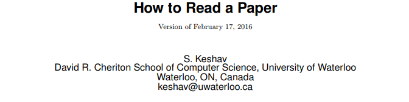

# How to Read a Paper

# 

1. 题目：How to Read a Paper
2. 作者：S. Keshav
3. 领域：计算机科学综述
4. 类型：方法论

> Researchers spend a great deal of time reading research papers. However, this skill is rarely taught, leading to much wasted effort. This article outlines a practical and efficient three-pass method for reading research papers. I also describe how to use this method to do a literature survey.

## 论文核心-三步走战略

# 

The key idea is that you should read the paper in up to three passes, instead of starting at the beginning and plowing your way to the end. Each pass accomplishes specific goals and builds upon the previous pass:

1. The first pass gives you **a general idea** about the paper.
2. The second pass lets you** grasp the paper''s content**, but not its details.
3. The third pass helps you **understand the paper** in depth.

### 第一步: 略读

# 

第一个过程是快速扫描，以**获得文件的概览。**您也可以决定是否需要做更进一步的阅读。此过程大约需要5到10分钟，包括以下步骤：

1. 看题目，摘要，引言
2. 看文章的层次结构（各个小标题如何安排，但是不要看正文）
3. 扫一扫文中的数学公式（了解文章涉及的数学知识）
4. 读结论
5. 扫参考文献（把那些读过的文献划去）。

读完第一轮，要明白:

1. 类型: 文章是属于什么类别的（度量现有成果？对现有的系统进行分析？提出一种研究原型？）
2. 内容: 文章的内容是否与其它论文相关？分析问题使用了什么样的理论基础?
3. 正确性: 作者提出的假设或者主张是否是正确的？
4. 贡献: 文章的主要贡献是什么？
5. 清晰: 文章的行文描述是否清晰？

在这一轮，不要读的太深，评估一下是否需要（值得）深入阅读, 此时没必要打印出来。 这可能是因为这论文并不让你感兴趣, 或者你还不是太了解论文涉及的领域, 或者作者做出了错误的假设. 对于那些不属于你的研究领域的论文来说，第一步就足够了，但总有一天会被证明是有意义的。

顺便说一句，当你写一篇论文时，你可以期望大多数的评审者(和读者)在你的文章上只会发生第一步. 注意**选择连贯的章节和副章节的标题，并写出简明而全面的摘要**。如果审阅者在一次过后不能理解要点，论文很可能会被拒绝；如果读者在五分钟后不能理解论文的要点，那么这篇论文很可能永远不会被阅读. 由于这些原因，用一个精选的图形来总结一篇论文的“图形摘要”是一个很好的想法，而且这种情况也越来越多地出现在科学期刊上。

### 第二步: 批判地读

# 

更注重细节的阅读, 但是要忽略例如证明的细节. 当你阅读的时候，记下要点，或者在页边空白处发表评论, 这都是有用的。

奥格斯堡大学的Dominik Grusemann建议你"*记下你不理解的术语，或者你可能想问作者的问题"*.

如果你是一个论文审稿人，这些评论将在你写评论的时候帮助你，并在计划委员会会议上支持你的评论。

1. 看图表是否正确、精准. 特别注意图, 坐标轴标注是否合适? 结果是否显示有误差栏，因此得出的结论在统计上是有意义的？像这样的常见错误会将匆忙、劣质的工作与真正优秀的工作区分开来。
2. 注意标注未阅读的文献以进一步阅读(这是一个进一步了解论文背景的好方法).

对于有经验的读者来说，第二步最多需要一个小时。经过这一步，你应该能够掌握论文的内容。你应该能够向其他人**概述这篇论文的主旨，并附上支持的证据**。这个层次的细节适合于你感兴趣的但并不在你的研究范围中的论文。

有时你甚至在第二遍结束时也看不懂一篇论文。这可能是因为该主题对您来说是新的，有不熟悉的术语和缩略语。

或者，作者可能使用了你不懂的证据或实验技术，因此论文的大部分内容是无法理解的。这篇论文可能写得很差，有未经证实的断言和大量的参考文献。也可能只是因为夜深了而且你累了。你现在可以选择：(A)把论文放在一边，希望你不需要理解这些材料就能在你的职业生涯中取得成功，(B)或许在读完背景资料后，再回来看这篇论文，(C)或者坚持下去，继续读到第三步。

### 第三步: 复现式阅读

# 

为了理解论文, 特别是你是一位审稿人, 那需要第三步. 关键是试图去虚拟地重现这篇论文: 像作者一样, 作出相同的假设, 重新创造(re-create)这份工作. 通过比较自己的重现与作者结果的差异，你可以会让你容易体会作者的创见，并且发现隐藏的缺陷和假设。

这一步需要注重细节. 你应该确定并质疑每一项陈述中的每一项假设. 更多的, 你应该考虑你自己将如何表达一个特定的观点. 这种实际与虚拟的比较有助于深入了解论文中的证明和演示的技术，您可以很容易地将其添加到您的工具库中。在这个过程中，你也应该写下对未来工作的想法.

这步对于初学者可能需要很多小时，甚至对于一个有经验的读者也甚至超过一个或两个小时。在这篇文章的末尾，你应该能够从记忆中重建论文的结构，并且能够识别它的优势与弱点。尤其是，你应该**能够精确地指出隐含的假设、相关工作的遗漏以及实验或分析技术的潜在问题**。

## 做文献调查

# 

论文阅读能力在做一次文献调查时受到考验。或许在一个陌生的领域里, 这将需要你阅读几十篇论文。那么, **你应该读什么样的论文**？

下面是如何使用三步法来获得帮助：

1. 首先，使用一个学术搜索引擎(如Google Scholar or CiteSeer)和一些精心选择的关键词来查找该领域最近的三到五篇被高度引用的论文。对每一篇论文做一次略读来了解其大致的工作，然后阅读相关工作的章节。你会发现最近的工作的缩略摘要，并且也许, 如果你幸运的话，一个指向最近的调查论文的方向。如果你能找到这样的调查论文，就可以了。读一读这份调查论文，祝贺自己好运。
2. 否则，在第二步中，在参考文献中查找共享的引用和重复的作者姓名。这些是该领域的关键论文和研究人员。下载关键论文并将其放在一边。然后访问关键研究人员的网站，看看他们最近在哪里发表了文章。这将帮助你确定该领域的顶级会议，因为最优秀的研究人员通常会在顶级会议上发表文章。
3. 第三步是访问这些顶级会议的网站，查看他们最近的会议记录。快速扫描通常会识别出最近的高质量的相关工作。这些文件，连同你先前搁置的那些，构成了你的调查的第一个版本. 对这些文件进行三步阅读法中的前两步, 如果他们都引用了一篇你之前没有找到的重要论文，那就去获取并阅读它，必要时再重复一遍。

## 相关工作

# 

如果你正在阅读一篇论文来做一个review，你也应该阅读Timothy Roscoe关于“Writing reviews for systems conferences”[[T. Roscoe, “Writing Reviews for Systems Conferences,”](http://people.inf.ethz.ch/troscoe/pubs/review-writing.pdf)] 的论文。如果你打算写一篇技术论文，你应该参考Henning Schulzrinne的综合网站[[H. Schulzrinne, “Writing Technical Articles,”](http://www.cs.columbia.edu/%E2%88%BChgs/etc/writing-style.html)]和George Whiteside对这一过程的杰出概述[[G.M. Whitesides, “Whitesides’ Group: Writing a Paper,”]()]。最后，Simon Peyton Jones有一个涵盖整个研究技能范围的网站[[S. Peyton Jones, “Research Skills,”](http://research.microsoft.com/en%02us/um/people/simonpj/papers/giving-a-talk/giving-a%02talk.htm)]。

Psychology, Inc. 的Iain H. McLean。已将可下载的“review matrix”组合在一起，使用实验心理学论文的三步方法[[I.H. McLean, "Literature Review Matrix,"](http://psychologyinc.blogspot.com/)]简化了论文评审，该方法经少量修改后可能可用于其他领域的论文。

## 参考链接

# 

1. 论文: <https://blizzard.cs.uwaterloo.ca/keshav/home/Papers/data/07/paper-reading.pdf>
2. 阅读笔记: [http://yugnaynehc.github.io/2015/11/13/how-to-read-a-paper](http://yugnaynehc.github.io/2015/11/13/how-to-read-a-paper/#more)