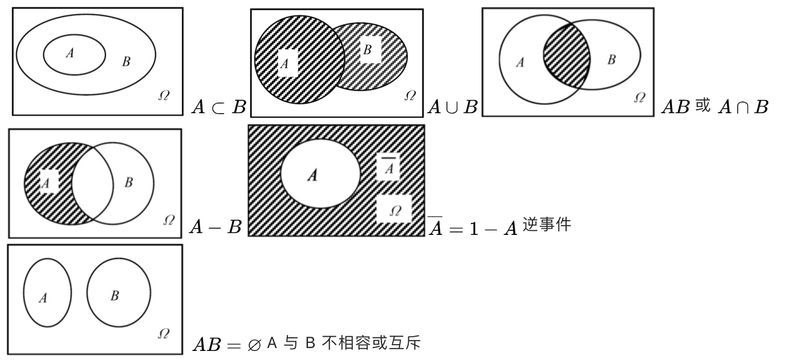
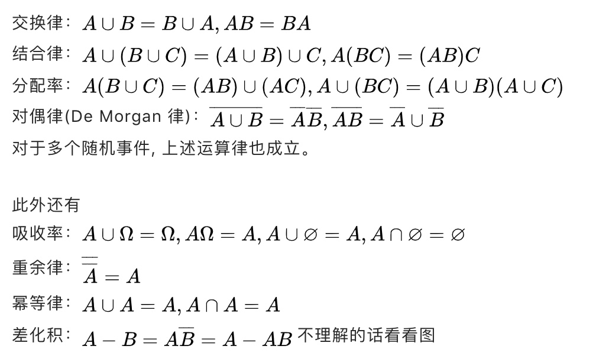

此门学科研究`随机现象`和`统计规律性`。

**统计规律性**：在大量重复试验中，呈现出的固有规律性。如重复抛硬币。
 **随机现象**：单次试验中结果呈现不确定性，大量重复试验中结果又具有统计规律性的现象。

### 样本空间

随机试验的可能结果集合。
掷硬币的样本空间为 {正，反}
掷骰子的样本空间为 {1,2,3,4,5,6}
城市发生交通事故的次数，样本空间为 {0,1,2,3,4,5,6....}

### 如何计算样本空间？

掷硬币，基本事件是 2，抛 3 次，则样本空间 = 23 = 2×2×2 = 8；抛 10 次，则样本空间 = 210

### 随机事件

事件是样本空间的子集，掷骰子有 6 个基本事件：{1},{2},{3},{4},{5},{6}
事件的关系：

交换律：

结合律：

分配率：

对偶律(De Morgan 律)：

对于多个随机事件, 上述运算律也成立。

此外还有

吸收率：

重余律：

幂等律：

差化积： 不理解的话看看图

