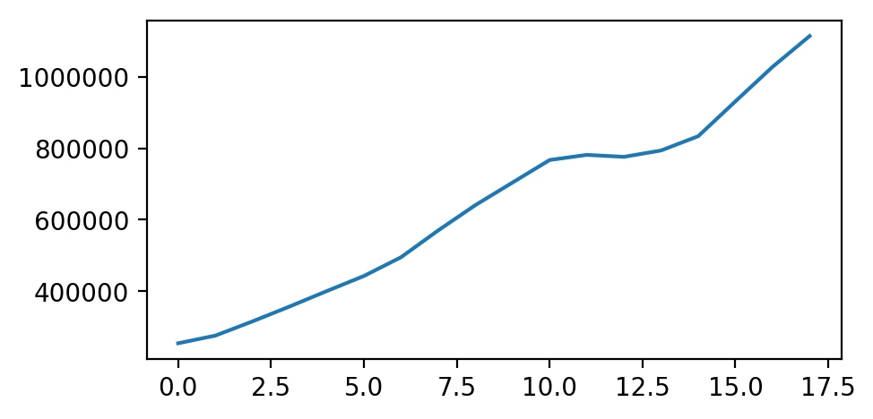
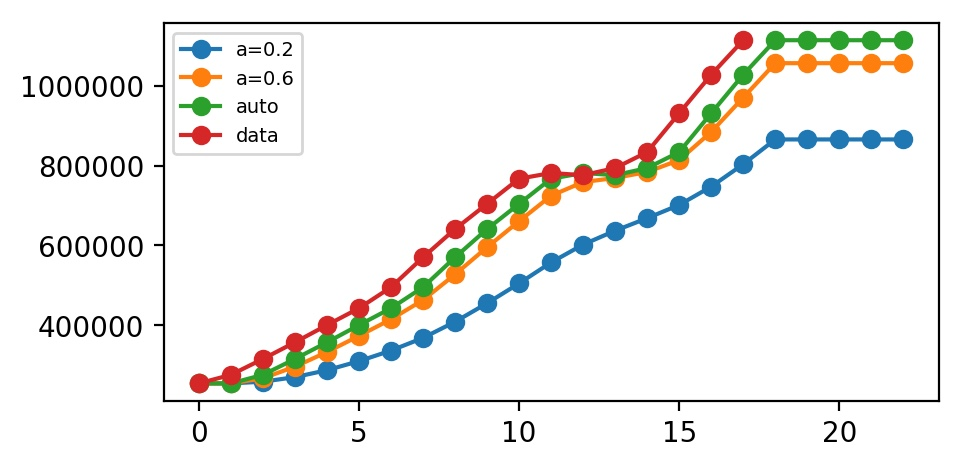
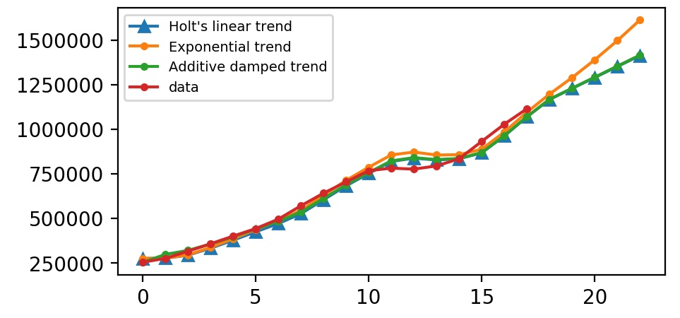
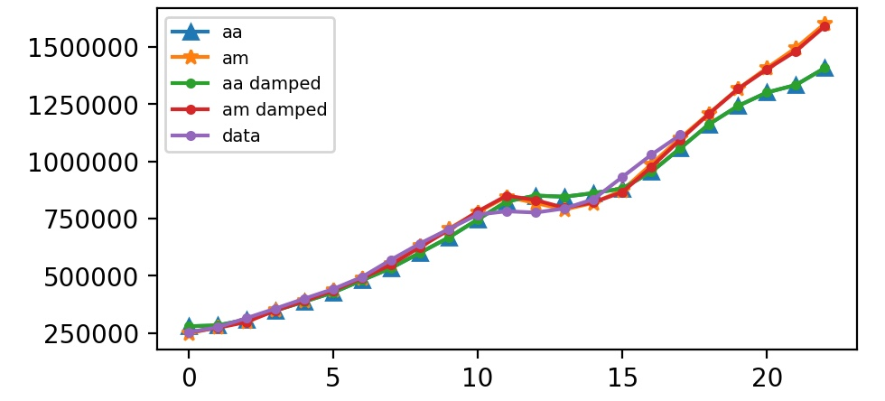
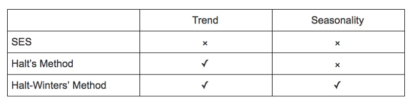
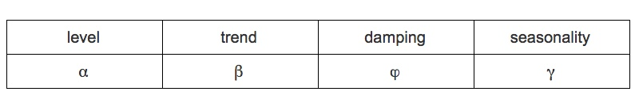

# 时间序列：Holt-Winters 平滑模型

原文：[How to Build Exponential Smoothing Models Using Python: Simple Exponential Smoothing, Holt, and…](https://medium.com/datadriveninvestor/how-to-build-exponential-smoothing-models-using-python-simple-exponential-smoothing-holt-and-da371189e1a1)

需要用到 statsmodels 这个包。
```python
import matplotlib.pyplot as plt
from statsmodels.tsa.holtwinters import ExponentialSmoothing, SimpleExpSmoothing, Holt
```

示例中的源数据：
```python
data = [253993,275396.2,315229.5,356949.6,400158.2,442431.7,495102.9,570164.8,640993.1,704250.4,767455.4,781807.8,776332.3,794161.7,834177.7,931651.5,1028390,1114914]
plt.plot(data);
```



<a name="ses"></a>
## 简单指数平滑(SES)
对于**没有明显趋势或季节规律**的预测数据，SES 是一个很好的选择。预测是使用加权平均来计算的，这意味着最大的权重与最近的观测值相关，而最小的权重与最远的观测值相关


\begin{equation}
\hat{y}_{T+1 | T}=\alpha y_{T}+\alpha(1-\alpha) y_{T-1}+\alpha(1-\alpha)^{2} y_{T-2}+\cdots
\end{equation}


<br />
<br />其中 0≤α≤1 是平滑参数。<br />权重减小率由平滑参数 α 控制。 如果 α 很大（即接近1），则对更近期的观察给予更多权重。 有两种极端情况：

- α= 0：所有未来值的预测等于历史数据的平均值（或“平均值”），称为**平均值法**。
- α= 1：简单地将所有预测设置为最后一次观测的值，统计中称为**朴素方法**。

这里我们运行三种简单指数平滑变体：

1. 在fit1中，我们明确地为模型提供了平滑参数α=0.2
1. 在fit2中，我们选择α=0.6
1. 在fit3中，我们使用自动优化，允许statsmodels自动为我们找到优化值。 这是推荐的方法。

```python
# Simple Exponential Smoothing
fit1 = SimpleExpSmoothing(data).fit(smoothing_level=0.2,optimized=False)
# plot
l1, = plt.plot(list(fit1.fittedvalues) + list(fit1.forecast(5)), marker='o')


fit2 = SimpleExpSmoothing(data).fit(smoothing_level=0.6,optimized=False)
# plot
l2, = plt.plot(list(fit2.fittedvalues) + list(fit2.forecast(5)), marker='o')


fit3 = SimpleExpSmoothing(data).fit()
# plot
l3, = plt.plot(list(fit3.fittedvalues) + list(fit3.forecast(5)), marker='o')

l4, = plt.plot(data, marker='o')
plt.legend(handles = [l1, l2, l3, l4], labels = ['a=0.2', 'a=0.6', 'auto', 'data'], loc = 'best', prop={'size': 7})
plt.show()

# 我们预测了未来五个点
```



<a name="holts"></a>
## Holt's 方法(二次指数平滑)
Holt扩展了简单的指数平滑（数据解决方案没有明确的趋势或季节性），以便在1957年预测数据趋势。Holt的方法包括预测方程和两个平滑方程（一个用于水平，一个用于趋势）：

\begin{equation}
\begin{array}{l}{\text { Forecast equation } \hat{y}_{t+h | t}=\ell_{t}+h b_{t}} \\ {\qquad \begin{array}{c}{\text { Level equation } \ell_{t}=\alpha y_{t}+(1-\alpha)\left(\ell_{t-1}+b_{t-1}\right)} \\ {\text { Trend equation } b_{t}=\beta^{*}\left(\ell_{t}-\ell_{t-1}\right)+\left(1-\beta^{*}\right) b_{t-1}}\end{array}}\end{array}
\end{equation}

其中0≤α≤1是水平平滑参数，0≤β∗≤1是趋势平滑参数。对于长期预测，使用Holt方法的预测在未来会无限期地增加或减少。 在这种情况下，我们使用具有阻尼参数0<φ<1的**阻尼趋势方法**来防止预测“失控”。

\begin{equation}
\begin{aligned} \hat{y}_{t+h | t} &=\ell_{t}+\left(\phi+\phi^{2}+\cdots+\phi^{h}\right) b_{t} \\ \ell_{t} &=\alpha y_{t}+(1-\alpha)\left(\ell_{t-1}+\phi b_{t-1}\right) \\ b_{t} &=\beta^{*}\left(\ell_{t}-\ell_{t-1}\right)+\left(1-\beta^{*}\right) \phi b_{t-1} \end{aligned}
\end{equation}

同样，这里我们运行Halt方法的三种变体：

1. 在`fit1`中，我们明确地为模型提供了平滑参数α=0.8，β∗=0.2。
1. 在`fit2`中，我们使用指数模型而不是Holt的加法模型（默认值）。
1. 在`fit3`中，我们使用阻尼版本的Holt附加模型，但允许优化阻尼参数φ，同时固定α=0.8，β∗=0.2的值。

```python
data_sr = pd.Series(data)
# Holt’s Method
fit1 = Holt(data_sr).fit(smoothing_level=0.8, smoothing_slope=0.2, optimized=False)
l1, = plt.plot(list(fit1.fittedvalues) + list(fit1.forecast(5)), marker='^')

fit2 = Holt(data_sr, exponential=True).fit(smoothing_level=0.8, smoothing_slope=0.2, optimized=False)
l2, = plt.plot(list(fit2.fittedvalues) + list(fit2.forecast(5)), marker='.')

fit3 = Holt(data_sr, damped=True).fit(smoothing_level=0.8, smoothing_slope=0.2)
l3, = plt.plot(list(fit3.fittedvalues) + list(fit3.forecast(5)), marker='.')

l4, = plt.plot(data_sr, marker='.')
plt.legend(handles = [l1, l2, l3, l4], labels = ["Holt's linear trend", "Exponential trend", "Additive damped trend", 'data'], loc = 'best', prop={'size': 7})
plt.show()
```



<a name="holt-winters"></a>
## Holt-Winters 方法(三次指数平滑)
(彼得·温特斯(Peter Winters)是霍尔特(Holt)的学生。霍尔特-温特斯法最初是由彼得提出的，后来他们一起研究。

Holt-Winters的方法适用于具有趋势和季节性的数据，其包括季节性平滑参数γγ。 此方法有两种变体：

- **加法方法**：整个序列的季节变化基本保持不变。
- **乘法方法**：季节变化与系列水平成比例变化。

在这里，我们运行完整的Holt-Winters方法，包括趋势组件和季节性组件。 Statsmodels允许所有组合，包括如下面的示例所示：

1. 在`fit1`中，我们使用加法趋势，周期`season_length = 4`的加性季节和`Box-Cox`变换。
1. 在`fit2`中，我们使用加法趋势，周期`season_length = 4`的乘法季节和`Box-Cox`变换。
1. 在`fit3`中，我们使用加性阻尼趋势，周期`season_length = 4`的加性季节和`Box-Cox`变换。
1. 在`fit4`中，我们使用加性阻尼趋势，周期`season_length = 4`的乘法季节和`Box-Cox`变换。

```python
data_sr = pd.Series(data)
fit1 = ExponentialSmoothing(data_sr, seasonal_periods=4, trend='add', seasonal='add').fit(use_boxcox=True)
fit2 = ExponentialSmoothing(data_sr, seasonal_periods=4, trend='add', seasonal='mul').fit(use_boxcox=True)
fit3 = ExponentialSmoothing(data_sr, seasonal_periods=4, trend='add', seasonal='add', damped=True).fit(use_boxcox=True)
fit4 = ExponentialSmoothing(data_sr, seasonal_periods=4, trend='add', seasonal='mul', damped=True).fit(use_boxcox=True)

l1, = plt.plot(list(fit1.fittedvalues) + list(fit1.forecast(5)), marker='^')
l2, = plt.plot(list(fit2.fittedvalues) + list(fit2.forecast(5)), marker='*')
l3, = plt.plot(list(fit3.fittedvalues) + list(fit3.forecast(5)), marker='.')
l4, = plt.plot(list(fit4.fittedvalues) + list(fit4.forecast(5)), marker='.')

l5, = plt.plot(data, marker='.')
plt.legend(handles = [l1, l2, l3, l4, l5], labels = ["aa", "am", "aa damped", "am damped","data"], loc = 'best', prop={'size': 7})

plt.show()
```



总而言之，我们通过3个指数平滑模型的机制和python代码。 如下表所示，我提供了一种为数据集选择合适模型的方法。<br />

总结了指数平滑方法中不同分量形式的平滑参数。<br />

指数平滑是当今行业中应用最广泛、最成功的预测方法之一。如何预测零售额、游客数量、电力需求或收入增长？指数平滑是你需要展现未来的超能力之一。